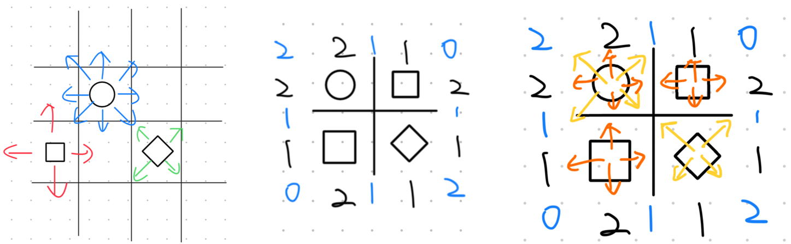
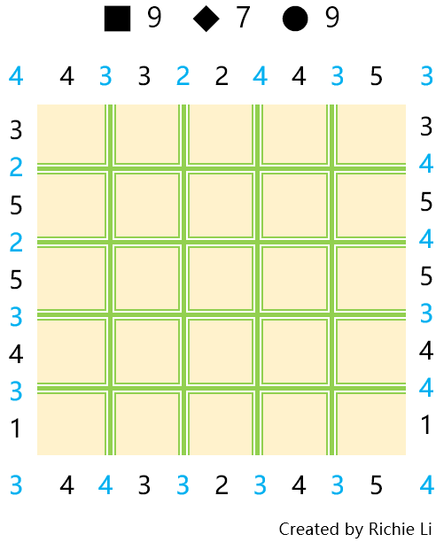
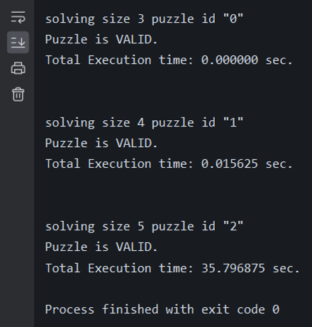

# Straight or Skew? --- A new puzzle

## Quick start
Download ```main.py, puzzle.py, and puzzle_data.json```
and run `main`. If you want to generate new puzzles, 
run `puzzle`. Puzzles generated are all stored in 
`puzzle_data.json`. PLease refer to the 
***
***The content below can also be found in the [presentation file](doc/IS_597_DS_Project_Presentation_240425.pdf) in `doc`***
## Introduction
This is a game that I might have invented myself. 
I was inspired by the PlayStation controller, 
which contains different shapes of buttons, and also 
by lots of square grid puzzles.

Players play on an `NxN` grid with numbers on the sides 
and place squares, diamonds, and circles in the cells.
A square can be seen straight, a diamond can be seen 
diagonally,and a circle can be seen in either direction,
as shown in the first following picture.

Note that instead of **4n** views (n=length of the grid),
we have **8n** views because we now have the skewed direction that ends differently than the straight ones. As shown in the third picture, the orange arrows point to black numbers, and the yellow arrows point to blue numbers.

Below is an example of what a puzzle looks like:


***
## Methods
### Data Structures
- Counter: dictionary
- Clues: lists in each direction
  - Straight (2)
  - Oblique (4)
- Grid: 2D object list
  - Cell: row, col, shape
### Algorithms
- General
  - Is the board full?
  - Place a shape into the grid
  - Is the puzzle valid?
  - Modifying the clues
- Solving:
  - Finding Solutions
    - What cell should we choose to place which shape, 
    brute force
  - Backtracking
    - If we did not successfully place a shape, go back and retry the last move, recursively
- Generating:
  - Randomly pick shapes to form an unvalidated puzzle
    - Solve it to see if we should regenerate

***
## Targeted Algorithm Analysis
1.`def is_valid(self, Cell) -> bool:`

- Checks if a placement is valid
- Modifies the shape of a cell (as if we were putting a shape into the grid)
- Add 1 to edge clues that are affected
  - Square, Diamond: 4 edges
  - Circle: 8 edges
- **Time complexity: O(4n) or O(8n) ~ O(n); n = size of the grid**

2.`def find_solutions(self) -> int:`

- Finds the number of solution(s) of the puzzle, breaks when over 1
- Places a valid move to the grid, if no more valid shapes to place, backtrack
- **Time complexity: O(k^(n^2)); k = kinds of shapes, n = size of the grid**
  - For example, a 4x4 and 5x5 will differ by at most 3^9 = 19683 times
  - The actual performance will not grow as slow as it would be,
  for there cannot be all 25 squares or all 25 circles in the grid
    (We do not need to consider wrong combinations of shapes)
  - Very sad performance, needs to add some deterministic methods
  besides applying brute force solving

***
## Performance Measurement
Comparing the solving speed of 3x3, 4x4, 5x5
- 3x3 and 4x4 are solved immediately, while
- 5x5 took half a minute!!



More can be found in the [presentation file](doc/IS_597_DS_Project_Presentation_240425.pdf).
***
## Future Work
I hope to create a GUI for this game so players can interact
with the program. And maybe implementing diffrent puzzle difficulties.
***
## Reference
[Undead from Simon Tatham's Portable Puzzle Collection](www.chiark.greenend.org.uk/~sgtatham/puzzles/js/undead.html)
